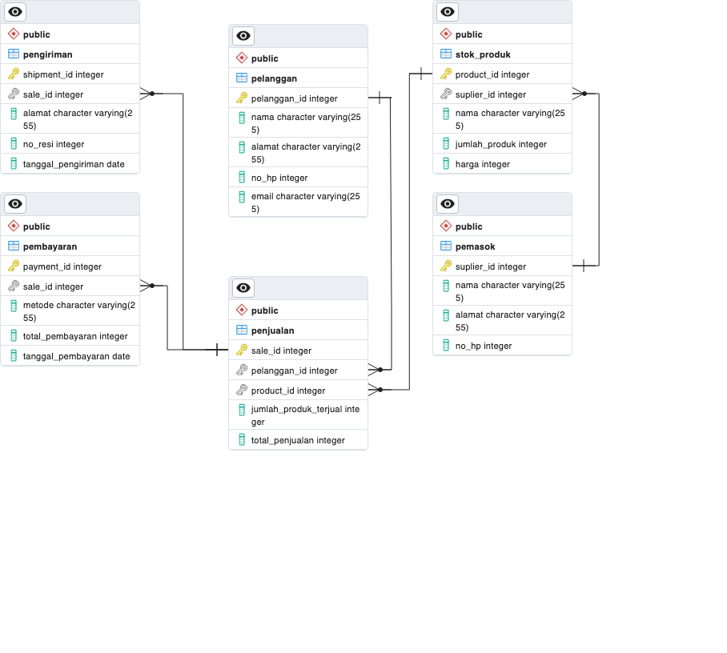

# Database_Ikan_hias
Database ini dirancang untuk mengelola data pelanggan, pemasok, stok produk, penjualan, pembayaran, dan pengiriman dalam suatu sistem penjualan bisnis ikan hias.

# Database Schema
Database ini menggunakan alur star schema dengan terdiri dari 5 tabel dimensi dan 1 tabel fakta. dengan alur data sebagai berikut:

# Business Flow
## 1.Pelanggan:
- Database akan menyimpan data pelanggan, seperti nama, alamat, nomor HP, dan email, dalam tabel "Pelanggan".
- Setiap pelanggan akan memiliki ID unik, sehingga informasi mereka dapat diidentifikasi secara efisien.

## 2.Pemasok (Supplier):
- Informasi pemasok, termasuk nama, alamat, dan nomor HP, akan diatur dalam tabel "Pemasok".
- Setiap pemasok akan diberi ID unik untuk memudahkan penelusuran.

## 3.Stok Produk:
- Data stok produk, seperti nama produk, jumlah, dan harga, akan disimpan dalam tabel "Stok_Produk".
- Informasi ini akan terkait dengan pemasok melalui ID pemasok, sehingga bisnis dapat melacak asal produk.

## 4.Penjualan:
- Ketika ada penjualan kepada pelanggan, data penjualan akan dicatat dalam tabel "Penjualan".
- Setiap penjualan memiliki ID yang mengidentifikasinya, dan informasi pelanggan serta produk yang terjual akan tercatat.

## 5.Pembayaran:
- Setiap pembayaran atas penjualan akan didokumentasikan dalam tabel "Pembayaran".
- Metode pembayaran, total pembayaran, dan tanggal pembayaran akan dicatat.

## 6.Pengiriman:
- Informasi pengiriman produk kepada pelanggan akan tercatat dalam tabel "Pengiriman".
- Ini mencakup alamat pengiriman, nomor resi, dan tanggal pengiriman.

Dengan database ini, anda sebagai pemilik bisnis dapat mengelola data pelanggan, pemasok, stok produk, penjualan, pembayaran, dan pengiriman dengan efisien, meningkatkan produktivitas dan pengendalian operasi penjualan.
